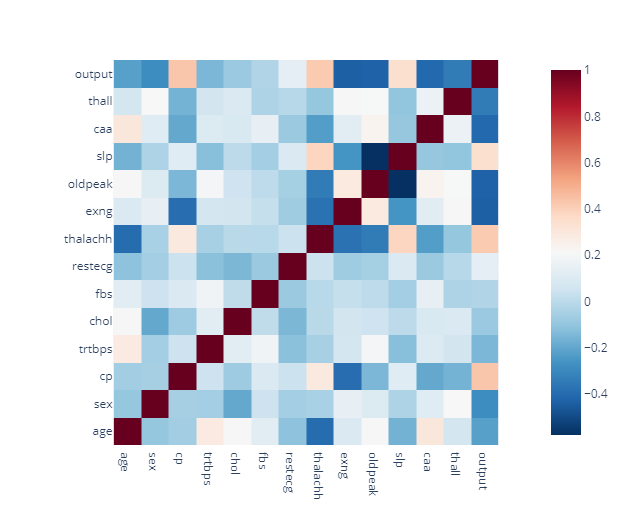

# Heart Attack Analysis & Prediction(Accuracy:85.24)
This iPython Notebook implements the Analysis and Predictions for Heart Attack. The Analysis is done on the dataset to identify the key features which has a impact on Heart Attack. After the analysis and data cleaning, the dataset is used to train the model using diffrent ML algorithm. The models are evealuated based on the accuracy of the prediticons and the best is selected and deployed.  
The dataset used has been taken from:  <a href="https://www.kaggle.com/datasets/rashikrahmanpritom/heart-attack-analysis-prediction-dataset">Kaggle: Heart Attack Analysis & Prediction Dataset</a>  
You can follow the analysis on <a href="https://www.kaggle.com/code/shrikrishnaparab/heart-attack-analysis-prediction-accuracy-85-24">Heart Attack Analysis & Prediction(Accuracy:85.24)</a>

## Packeges Used:
 ![Python][python] ![scikit-learn][sklearn-image] ![NumPy][numpy-image] ![Pandas][Pandas-image] ![Matplotlib][Matplotlib-image] ![Plotly][Plotly-image]  ![Jupyter Notebook][ipython-image]
 
[python]: https://img.shields.io/badge/python-3670A0?style=for-the-badge&logo=python&logoColor=ffdd54
[sklearn-image]:https://img.shields.io/badge/scikit--learn-%23F7931E.svg?style=for-the-badge&logo=scikit-learn&logoColor=white
[numpy-image]: https://img.shields.io/badge/numpy-%23013243.svg?style=for-the-badge&logo=numpy&logoColor=white
[Pandas-image]: https://img.shields.io/badge/pandas-%23150458.svg?style=for-the-badge&logo=pandas&logoColor=white
[Matplotlib-image]: https://img.shields.io/badge/Matplotlib-%23ffffff.svg?style=for-the-badge&logo=Matplotlib&logoColor=black
[Plotly-image]: https://img.shields.io/badge/Plotly-%233F4F75.svg?style=for-the-badge&logo=plotly&logoColor=white
[ipython-image]: https://img.shields.io/badge/jupyter-%23FA0F00.svg?style=for-the-badge&logo=jupyter&logoColor=white

# Introduction
Heart attacks, also known as myocardial infarctions, occur when the blood flow to a portion of the heart is blocked, usually by a clot in a coronary artery. This lack of blood flow causes damage or death of the heart muscle. There are several risk factors for heart attacks, including high blood pressure, high cholesterol, smoking, diabetes, and a family history of heart disease. Some of these risk factors can be controlled through lifestyle changes and medication, while others cannot be changed. There are several methods for predicting the risk of a heart attack, including the Framingham Risk Score and the Reynolds Risk Score. These scores take into account several risk factors, including age, gender, cholesterol levels, and blood pressure.  
Machine learning and predictive modeling techniques can also be used to predict the risk of heart attacks using electronic health records (EHRs) and other data sources.
There are several machine learning (ML) techniques that can be used for analyzing and predicting heart attacks. Some of the most commonly used techniques include:
## Logistic regression:  
A simple yet powerful technique that can be used to predict binary outcomes, such as the presence or absence of a heart attack.
## Decision trees:  
A tree-based model that can be used to identify the most important risk factors for a heart attack and the threshold values at which they become significant.
## Random forest:  
An extension of decision trees that uses multiple trees and averaging to improve the accuracy and robustness of predictions.
## Gradient boosting:  
An ensemble technique that combines multiple weak models to create a stronger overall model.
## Support Vector Machines (SVMs):  
A technique that can be used to classify patients into different risk groups based on multiple features.
## Neural networks:  
Multi-layer perceptron (MLP) and Convolutional Neural Networks (CNNs) are two types of neural networks that can be used to identify complex patterns and relationships in patient data.

## K-Nearest Neighbors (KNN)
K-Nearest Neighbors (KNN) is a machine learning (ML) algorithm that can be used for heart attack prediction. The KNN algorithm is a non-parametric method that can be used for both classification and regression tasks.  
In the context of heart attack prediction, KNN would be used for classification, where the goal is to predict whether a patient is likely to have a heart attack or not. The algorithm works by finding the k nearest data points to a new patient in the training dataset and then classifying the new patient based on the majority class of the k nearest data points. The key to the KNN algorithm is the distance metric used to find the nearest neighbors. Commonly used distance metrics include Euclidean, Manhattan, and Minkowski distance. The choice of distance metric will depend on the nature of the data and the specific problem being solved.

## About Dataset:  The Dataset hav 303 rows and 14 columns, there are no null values and there in one duplicate row.
    - Age : Age of the patient  
    - Sex : Sex of the patient  
    - exng: exercise induced angina (1 = yes; 0 = no)  
    - caa: number of major vessels (0-3)  
    - cp : Chest Pain type chest pain type  
           Value 1: typical angina  
           Value 2: atypical angina  
           Value 3: non-anginal pain  
           Value 4: asymptomatic  
    - trtbps : resting blood pressure (in mm Hg)  
    - chol : cholestoral in mg/dl fetched via BMI sensor  
    - fbs : (fasting blood sugar > 120 mg/dl) (1 = true; 0 = false)  
    - restecg : resting electrocardiographic results  
           Value 0: normal  
           Value 1: having ST-T wave abnormality (T wave inversions and/or ST elevation or depression of > 0.05 mV)  
           Value 2: showing probable or definite left ventricular hypertrophy by Estes' criteria  
    - thalach : maximum heart rate achieved    
    - oldpeak : Previous peak  
    - slp: Slope  
    - thal : Thal rate  
    - Output : 0 = less chance of heart attack 1 = more chance of heart attack  

## Data Analysis:
You can go through the iPython file for more in detail EDA results. Here is the correlation matix for the dataset:

## Data Cleaning and Data wrangling:  
    - Data Scaling: This is done using standardScalar from sklearn
    - We have use StratifiedShuffleSplit so that the test and traing data has equal number of Output values. 

## Model Training:
We have used set of Algorithms to check which algoritm gives us the max accuracy.  
     - logistic_regression   
     - Gaussian_Naive_Bayes  
     - Bernoulli_Naive_Bayes  : 
     - svm 
     - knn  
     - Optimized_knn  
     - X_Gradient_Boosting  
     - random_forest  

## Results:
We have Evaluated and compared set of algorithms for the predictions and we have the results as below:  
     - logistic_regression  :  78.68852459016394  
     - Gaussian_Naive_Bayes  :  81.9672131147541  
     - Bernoulli_Naive_Bayes  :  80.32786885245902  
     - svm  :  83.60655737704919  
     - knn  :  75.40983606557377  
     - Optimized_knn  :  85.24590163934425  
     - X_Gradient_Boosting  :  80.32786885245902  
     - random_forest  :  80.32786885245902  
     
## Conclusion: 
The Optimized KNN for K=14 works best for the above scenario. 
